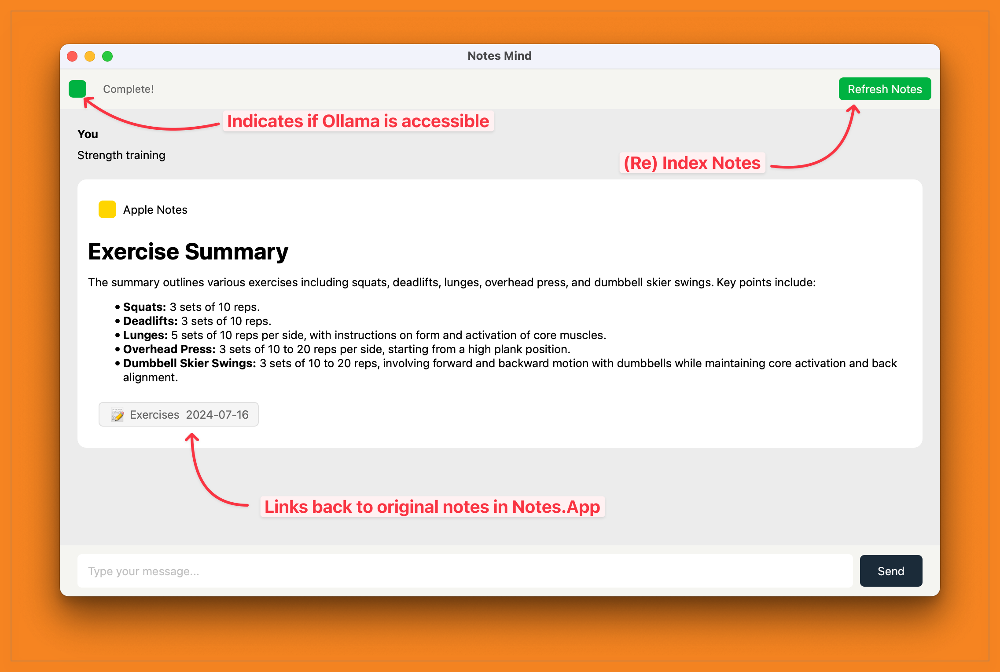

# Notes Mind

Private / Local setup to chat with Apple Notes

**Github repository**: https://github.com/namuan/notes-mind/

## Technical Details

- **Apple Notes Extraction:** Uses AppleScript to extract your notes from the native Apple Notes application.
- **Embeddings Generation:** Generates semantic embeddings using Sentence Transformers.
- **Vector Search & Full Text Search:** Stores notes in SQLite and enables fast searches with both vector (sqlite-vec) and FTS queries.
- **Chat Interface Summarization:** Generates summary using a local LLM on Ollama
